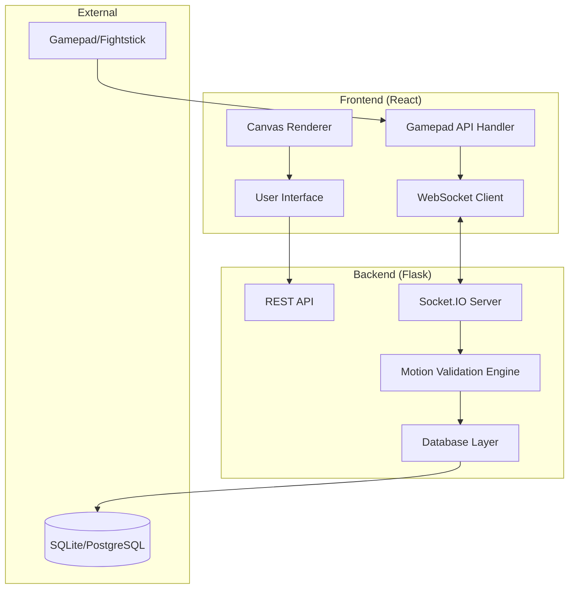

# Design Document

## Overview

The Fighting Game Motion Input Trainer is a web-based application that provides real-time training for fighting game motion inputs. The system uses a React frontend for user interface and visualization, with a Flask backend handling input processing, motion validation, and data persistence. Real-time communication is achieved through WebSocket connections for low-latency feedback.

## Architecture

### System Architecture



### Technology Stack

**Frontend:**
- React 18 with Vite for fast development
- Canvas API or React-Konva for motion visualization
- Socket.IO client for real-time communication
- Zustand for state management
- Web Gamepad API for controller input

**Backend:**
- Flask with Flask-SocketIO for WebSocket support
- SQLAlchemy for database ORM
- SQLite for development, PostgreSQL for production
- Eventlet for async socket handling

## Components and Interfaces

### Frontend Components

#### Core Components
- `TrainingPage`: Main training interface container
- `PromptDisplay`: Shows current motion input prompt with visual diagram
- `InputVisualizer`: Real-time display of controller input state
- `ScoreBoard`: Performance metrics display (speed, accuracy, streak)
- `ModeSelector`: Training mode and difficulty selection
- `ProgressTracker`: Historical performance and improvement trends

#### Custom Hooks
- `useGamepad`: Manages Gamepad API integration and input polling
- `useWebSocket`: Handles Socket.IO connection and event management
- `useTrainingSession`: Manages training state and session logic

### Backend Components

#### API Endpoints
```python
# REST API Routes
GET /api/modes          # Available training modes
GET /api/motions        # Motion library by difficulty
GET /api/history/:user  # User training history
POST /api/session       # Start new training session
```

#### WebSocket Events
```python
# Real-time events
'connect'           # Client connection
'start_training'    # Begin training session
'input_data'        # Raw controller input
'motion_result'     # Validation result
'session_complete'  # End session, save results
```

#### Core Services
- `MotionValidator`: Processes and validates motion input sequences
- `PromptGenerator`: Creates training prompts based on mode/difficulty
- `SessionManager`: Handles training session state and scoring
- `DatabaseService`: Manages data persistence and retrieval

## Data Models

### Motion Input Model
```python
class MotionInput:
    timestamp: float
    x_axis: float      # -1.0 to 1.0
    y_axis: float      # -1.0 to 1.0
    buttons: dict      # button states
    
class MotionPattern:
    name: str          # "Quarter Circle Forward"
    sequence: list     # ["↓", "↘", "→", "P"]
    max_time: float    # Maximum execution time
    difficulty: str    # "beginner", "intermediate", "advanced"
```

### Training Session Model
```python
class TrainingSession:
    id: str
    user_id: str
    mode: str          # "drill", "mixed", "combo"
    difficulty: str
    start_time: datetime
    end_time: datetime
    total_prompts: int
    correct_inputs: int
    average_speed: float
    best_streak: int
```

### User Performance Model
```python
class UserPerformance:
    user_id: str
    session_id: str
    motion_name: str
    execution_time: float
    accuracy: bool
    input_sequence: list
```

## Motion Validation Algorithm

### Input Processing Pipeline

1. **Raw Input Capture**: Gamepad API provides continuous polling of controller state
2. **Direction Mapping**: Convert analog stick coordinates to 8-directional input
3. **Sequence Detection**: Track directional transitions within timing windows
4. **Pattern Matching**: Compare detected sequence against expected motion
5. **Tolerance Application**: Apply configurable timing and precision tolerances

### Direction Detection Logic
```python
def map_direction(x, y, deadzone=0.3):
    if abs(x) < deadzone and abs(y) < deadzone:
        return "neutral"
    
    # Normalize to 8 directions
    angle = math.atan2(y, x)
    directions = ["→", "↘", "↓", "↙", "←", "↖", "↑", "↗"]
    index = round(angle / (math.pi / 4)) % 8
    return directions[index]
```

### Timing Windows
- **Beginner**: 400ms between directional inputs
- **Intermediate**: 250ms between directional inputs  
- **Advanced**: 150ms between directional inputs
- **Button Press**: Must occur within 100ms of final direction

## Error Handling

### Frontend Error Handling
- **Controller Disconnection**: Graceful fallback with reconnection prompts
- **WebSocket Disconnection**: Automatic reconnection with session state preservation
- **Input Lag Detection**: Warning when input processing exceeds thresholds
- **Browser Compatibility**: Fallback for browsers without Gamepad API support

### Backend Error Handling
- **Invalid Input Data**: Sanitization and validation of all incoming data
- **Database Failures**: Graceful degradation with local session storage
- **WebSocket Errors**: Connection state management and cleanup
- **Motion Validation Errors**: Detailed error reporting for debugging

### Performance Monitoring
- **Input Latency Tracking**: Monitor end-to-end input processing time
- **Frame Rate Monitoring**: Ensure consistent 60fps rendering
- **Memory Usage**: Prevent memory leaks in long training sessions
- **Network Performance**: Track WebSocket message frequency and size

## Testing Strategy

### Frontend Testing
- **Unit Tests**: Component logic and custom hooks using Jest/React Testing Library
- **Integration Tests**: WebSocket communication and gamepad input simulation
- **Visual Tests**: Canvas rendering and animation accuracy
- **Performance Tests**: Input latency and rendering performance benchmarks

### Backend Testing
- **Unit Tests**: Motion validation logic and database operations using pytest
- **API Tests**: REST endpoint functionality and error handling
- **WebSocket Tests**: Real-time event handling and connection management
- **Load Tests**: Multiple concurrent users and high-frequency input processing

### End-to-End Testing
- **User Flow Tests**: Complete training sessions with simulated controller input
- **Cross-Browser Tests**: Gamepad API compatibility across different browsers
- **Performance Tests**: Input-to-feedback latency measurements
- **Stress Tests**: Extended training sessions and memory usage validation

### Motion Accuracy Testing
- **Reference Implementation**: Known-good motion sequences for validation
- **Edge Case Testing**: Boundary conditions and timing edge cases
- **Tolerance Testing**: Verify acceptable input variations are recognized
- **False Positive Testing**: Ensure incorrect motions are properly rejected